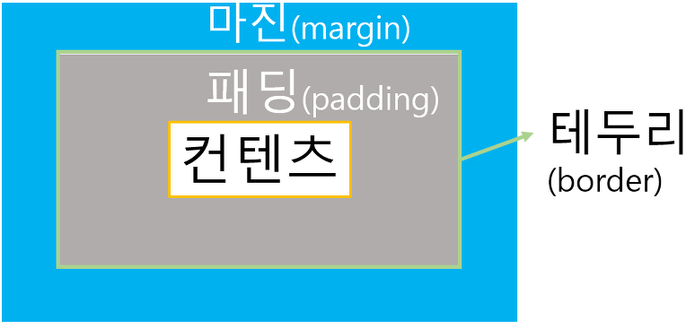

# 네이버 클론 코딩 (HTML, CSS)

## 1. HTML 파일 만들기

```html
<head></head>
```

- html 문서에 대한 설명

```html
<meta />
```

- 데이터에 대한 설명

```html
<body></body>
```

- 해당 HTML 문서의 텍스트, 하이퍼링크, 이미지, 리스트 등과 같은 모든 콘텐츠를 포함하는 영역을 정의할 때 사용

```html
<meta http-equiv="X-UA-Compatible" content="IE=edge" />
```

- 인터넷 익스플로러에서 웹 페이지가 최신기술로 표시될 수 있게 해줌

## 2. favicon

웹사이트 또는 웹 페이지를 대표하기 위해 웹 브라우저에서 사용되는 16x16 픽셀의 작은 이미지

```html
<link rel="shortcut icon" type="image/x-icon" href="./favicon.ico" />
```

- 개발자 모드에서 head 태그 안에 있는 favicon 복사

- "/favicon.ico?1"는 네이버 서버 안에 있는 favicon.ico를 가져오기 때문에
  url창에 www.naver.com/favicon.ico 입력 후 favicon 이미지 복사 후 디렉토리 내에 저장


## 3. div 영역 작성(block, inline-block,inline)



#### margin

다른 요소와의 간격을 나타내는 공간

#### border

요소의 테두리를 나타냄

#### padding

내용과 테두리 사이의 공간

### content

실제 내용을 포함하는 영역

```html
<!DOCTYPE html>
<html lang="en">
  <head>
    <meta charset="UTF-8" />
    <meta http-equiv="X-UA-Compatible" content="IE=edge" />
    <meta name="viewport" content="width=device-width, initial-scale=1.0" />
    <title>NAVER</title>
    <link rel="shortcut icon" type="image/x-icon" href="./favicon.ico" />
    <style>
      #wrap {
        text-align: center;
      }
      #wrap-center {
        width: 1280px;
        background-color: yellow;
        display: inline-block;
      }
      #main {
        height: 2000px;
      }
    </style>
  </head>
  <body>
    <div id="wrap">
      <div id="wrap-center">
        <div id="header"></div>
        <div id="search"></div>
        <div id="nav"></div>
        <div id="main"></div>
      </div>
    </div>
  </body>
</html>
```

##### div 태그

- 블록 레벨 요소
- 콘테이너 역할
- 의미 없는 태그
- 스타일링 및 스크립팅의 훅
- 플렉서블
- 접근성 문제

##### span 태그

- 인라인 요소
- 의미 없는 태그
- 스타일링 및 스크립팅의 훅
- 플렉서블
- 특정 부분 강조
- 접근성 문제

### CSS
##### display: block
- 요소가 전체 너비를 차지하며, 위에서 아래로 쌓임
- width와 height 속성을 사용하여 크기를 지정할 수 있음
- div, p, h1, h6 등

##### display: inline
- 요소만큼만 차지
- 새로운 줄에서 시작하지 않으며, 다른 inline 요소나 텍스트와 함께 같은 줄에 위치함
- width와 height 속성이 적용되지 않음
- span, a, strong 등

##### display inline-block
- inline 과 block의 특징을 결합한 유형
- 새로운 줄에서 시작하지 않으며, 다른 inline요소나 텍스트와 함께 같은 줄에
위치함
- width와 height 속성을 사용하여 크기를 지정할 수 있음

##### 차이점 요약

- block: 전체 너비를 차지하며 새로운 줄에서 시작함. 크기 조절이 가능.
- inline: 필요한 만큼의 너비만 차지하며, 크기 조절이 불가능함
- inline-block: 필요한 만큼의 너비를 차지하면서도 크기 조절이 가능함


